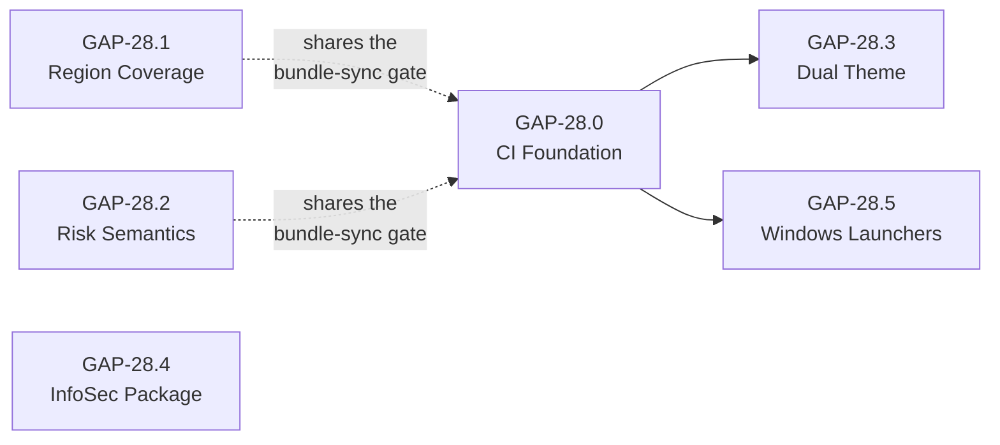

# GAP-28 — Enterprise Field Readiness

**Epic ID:** GAP-28
**Target Release:** v1.4.4
**Reference:** Enterprise field feedback & large customer engagements (anonymized)
**Status:** SHIPPED — all child specs `SHIPPED`
**Last Updated:** September 16, 2026

---

## Why this epic exists

The analytics engine is sound — cost attribution, HBO, capacity simulation and the report generator all
ship today with 29 test modules behind them. **The friction is entirely in the first 30 minutes of an
evaluation**, and it costs us evaluations that never reach the value.

| Field objection | Where the evaluation dies | Spec |
| :--- | :--- | :--- |
| "It won't run on my Windows laptop." | Minute 2 — zero value delivered | [GAP-28.5](GAP-28.5-windows-launchers.md) |
| "It's dark mode — I can't put text-on-black in a CFO deck." | Blocks the artifact that travels inside the customer | [GAP-28.3](GAP-28.3-dual-theme.md) |
| "There's no Europe in the region dropdown." | Disqualifies every EU-resident dataset | [GAP-28.1](GAP-28.1-region-coverage.md) |
| "What does *Risk Status* mean? Why is everything red?" | Erodes trust in every number on the page | [GAP-28.2](GAP-28.2-risk-status-semantics.md) |
| "Send our CISO the exact IAM roles and prove you can't read our data." | Stalls in security review for weeks | [GAP-28.4](GAP-28.4-infosec-package.md) |

Unlike a runtime cost defect, every one of these is deterministic, self-inflicted, and cheap to fix.

### Preventive control already shipped

**Google Cloud Shell** landed in v1.4.4 as deployment Option 2 (one-click badge, standard Linux runtime,
native HTTPS Web Preview on port 8080). It already resolves the Windows onboarding blocker with no code,
which is why native Windows launchers are sequenced **last**, not first.

---

## Child specs

| Spec | Title | Module | Effort | Depends on |
| :--- | :--- | :--- | :--- | :--- |
| [GAP-28.0](GAP-28.0-ci-foundation.md) | CI Foundation & Bundle Sync Gate | General UI / UX | M (2-3 d) | — |
| [GAP-28.1](GAP-28.1-region-coverage.md) | Global Region Coverage & Error Taxonomy | Settings & Project Scoping | M (2-3 d) | — |
| [GAP-28.2](GAP-28.2-risk-status-semantics.md) | Risk Status Semantics & FinOps Glossary | Storage Hygiene & Time Travel | M (2-3 d) | — |
| [GAP-28.3](GAP-28.3-dual-theme.md) | Dual Theme Engine (Corporate Light Mode) | General UI / UX | L (6-8 d) | 28.0 |
| [GAP-28.4](GAP-28.4-infosec-package.md) | Enterprise InfoSec & Deployment Package | Governance & Partition Guardrails | L (4-6 d) | — |
| [GAP-28.5](GAP-28.5-windows-launchers.md) | Native Windows Launchers & Cross-Platform Hardening | General UI / UX | S (1-2 d) | 28.0 |

### Recommended sequence

`28.0` → (`28.1` ‖ `28.2`) → `28.3` → `28.4` → `28.5`

28.1 and 28.2 are independent of each other and can run in parallel. 28.4 has no code dependency and can
start any time a second pair of hands is free.

---

## Shared context every implementer must read

Four traps verified against the live codebase. Each is restated in the spec it affects; they are
collected here because more than one spec trips over them.

### T1 · The Vanishing Token Trap
The design system is **not** `:root`-based. `static/style.css:6` declares tokens on `.dark-theme` in two
layers — raw HSL triplets *and* a derived mapping layer (`--bg-primary: hsl(var(--background))`). Swapping
the body class deletes **both**, so the page renders unstyled rather than light. See
[GAP-28.3 §4.1](GAP-28.3-dual-theme.md).

### T2 · The Inline Style Trap
`static/index.html` carries **753** `style="…"` attributes and `static/app.js` builds table rows with
**324** hardcoded color literals. A token-only change repaints the chrome and leaves every badge
dark-on-white. See [GAP-28.3 §4.3](GAP-28.3-dual-theme.md).

### T3 · The Region Prefix Trap
Two conventions coexist: the UI and all Pydantic models use `region-us`
(`src/main.py:460,788,1225,1353,1537,2005`), `src/main.py:2628` strips the prefix for the job `location`,
and `src/bqrecommender.py:226` expects the **bare** form. Emitting bare values from the dropdown produces
`region-region-us` in one path and a valid query in another. See
[GAP-28.1 §4.1](GAP-28.1-region-coverage.md).

### T4 · The Duplicate Bundle Trap
`docs/static/app.js` and `docs/static/style.css` are **byte-identical copies** of `static/`, and
`docs/simulator.html` loads `./static/style.css`. Precedent exists — `tests/test_batch_candidates.py:139`
asserts `BUNDLES = ["static/app.js", "docs/static/app.js"]`. Every frontend change lands twice. See
[GAP-28.0 §4.2](GAP-28.0-ci-foundation.md).

---

## Locked decisions

| # | Decision | Rationale |
| :--- | :--- | :--- |
| D1 | Light theme via a `.light-theme` body class overriding HSL triplets — **not** `:root` + `[data-theme]` | Preserves all 358 existing `var(--…)` call sites |
| D2 | **Full sweep** of inline styles and JS literals, not a token-only pass | A half-themed light mode is worse than none for the audience that asked for it |
| D3 | Sweep executed by codemod, committed **view-by-view** | Blast radius per commit is one view; each is independently revertible |
| D4 | Playwright dual-theme snapshots + automated WCAG AA contrast gate | 753 sites × 2 themes × 2 bundles is not manually verifiable |
| D5 | Risk Status: change the **code** to a 4-state model, don't just document the current 2-state logic | The objection is semantic — the fix is to stop saying "red" |
| D6 | Regions: `region-` prefixed everywhere + a central `normalize_region()` | Ends the UI↔`bqrecommender` convention split rather than papering over it |
| D7 | List **all** BigQuery regions, backed by a precise error taxonomy | Absence looks like a product gap; a good error message does not |
| D8 | (Superseded) Windows launchers auto-set `AUTH_ENFORCED_UPSTREAM=true`. The flag has been removed; launchers instead hard-pin `--host 127.0.0.1` and print a loopback-only notice | Accepted with bounded blast radius |

---

## Epic-level open questions

| # | Question | Default if unanswered |
| :--- | :--- | :--- |
| Q1 | Rename the report's priority bands to `P0…P3/FYI` to end the `Critical`/`High` collision with the storage badge? | Keep current names; disambiguate in the glossary only |
| Q2 | Light-mode the exported HTML/PDF report (`static/report.css`, 1,196 lines)? | Out of scope for v1.4.4 |
| Q3 | Vendor the three CDN assets (Chart.js, Font Awesome, DataTables) for air-gapped security reviews? | Document only; no vendoring |
| Q4 | Public version number for this epic | `v1.4.4` |

---

## Definition of done for the epic

* All six child specs `SHIPPED`.
* CI green on `ubuntu-latest` **and** `windows-latest`.
* `README.md` updated: light-mode screenshot, Windows section, links to the security whitepaper.
* `RELEASE_NOTES.md` entry for v1.4.4 including the **customer-visible Risk Status reclassification**.
