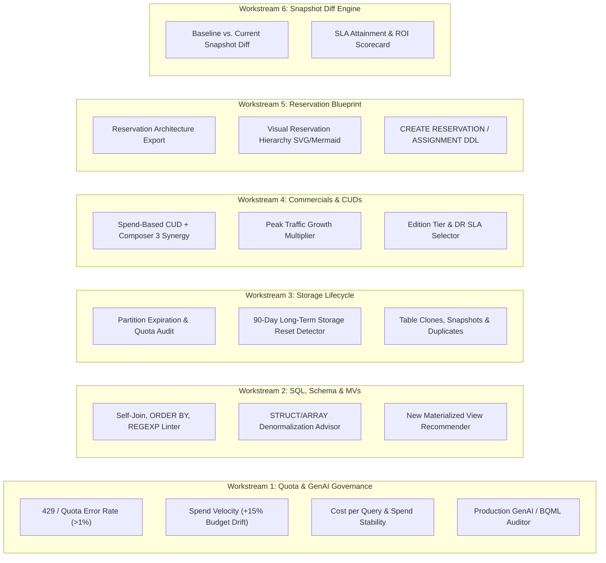

# Implementation Plan: 100% FinOps & Workload Optimization Coverage

This plan closes **all remaining functional and feature gaps** in **FinOps Optimizer for BigQuery** across six core areas:
1. **Proactive Health, Quota & GenAI Workload Governance**
2. **Advanced SQL Refactoring, Schema Denormalization & Materialized View Discovery**
3. **Storage Lifecycle, 90-Day Long-Term Discount Preservation, Table Clones & Deduplication**
4. **Commercial CUD Modeling (Spend-Based CUDs & Cross-Service Synergy) & Peak Traffic Simulation**
5. **Reservation Architecture Blueprint & Capacity DDL Generator**
6. **Baseline vs. Post-Optimization Snapshot Comparison (ROI Diff Engine)**

> [!IMPORTANT]
> **Zero Data-Plane Guarantee Preserved:** All new analytical modules operate strictly on public BigQuery `INFORMATION_SCHEMA` control-plane views (`JOBS_BY_ORGANIZATION`, `JOBS_TIMELINE_BY_ORGANIZATION`, `TABLE_STORAGE_BY_ORGANIZATION`, `SCHEMATA_OPTIONS`, `TABLE_OPTIONS`). None require `bigquery.tables.getData` on BigQuery user tables.

---

## Architecture Overview (6 Workstreams)

---

## Proposed Changes by Workstream

### Workstream 1: Quota/429 Health Alerts, Budget Velocity & GenAI Workload Auditor

#### [MODIFY] `src/main.py`
* **Add `POST /api/health/triggers` (`analyze_finops_health_triggers`):**
  * **429 & Quota Throttling Rate (`>1%` Threshold):** Queries `JOBS_BY_ORGANIZATION` to compute the percentage of jobs failing with `error_result.reason IN ('rateLimitExceeded', 'quotaExceeded', 'resourcesExceeded')` and measures concurrency saturation against BigQuery's 100-interactive-query limit and 1,500 daily DML table modification ceiling.
  * **Budget Drift (`+15%` Threshold), Spend Stability & Cost-per-Query:** Compares current period (`[0..N]` days) vs. prior baseline period (`[N..2N]` days) and an optional `monthly_budget_usd` parameter. Returns:
    * `spend_growth_pct` (flags `CRITICAL` if $\ge 15\%$),
    * `daily_spend_cv` (Coefficient of Variation $\sigma / \mu$ measuring Spend Stability),
    * `avg_cost_per_query_usd` (`total_spend / total_queries`).
  * **Project & User Cost-Control Safeguards Check:** Identifies projects and high-spend BigQuery users executing un-capped queries (>100 GiB without job-level `maximum_bytes_billed` patterns) and generates recommended project/user daily byte quota configurations (`QueryUsagePerDay` / `QueryUsagePerUserPerDay`).
* **Add `POST /api/workloads/genai` (`analyze_genai_workloads`):**
  * Scans `JOBS_BY_ORGANIZATION` for production GenAI and BQML patterns (`AI.GENERATE`, `ML.GENERATE_TEXT`, `ML.GENERATE_EMBEDDING`, `VECTOR_SEARCH`, `CREATE MODEL`).
  * Reports slot-hours consumed, Vertex AI remote endpoint throttling (`429` errors), and flags GenAI batch pipelines competing with interactive BI reservations.

---

### Workstream 2: SQL Anti-Patterns, Schema Denormalization (`STRUCT`/`ARRAY`) & New Materialized View Discovery

#### [MODIFY] `src/main.py`
* **Expand `analyze_query_linter` (`/api/antipatterns/linter`):**
  * Extend regex/AST classification in SQL pushdown beyond `[SELECT * ABUSE]` to detect:
    1. `[SELF-JOIN → WINDOW FUNCTION]`: Same table referenced $\ge 2$ times in `FROM`/`JOIN` — recommends `LAG()`, `LEAD()`, or `ROW_NUMBER() OVER()`.
    2. `[ORDER BY WITHOUT LIMIT]`: Top-level `ORDER BY` on queries scanning $>10\text{ GiB}$ without `LIMIT`.
    3. `[REGEXP OVER LIKE]`: `REGEXP_CONTAINS` with simple alphanumeric/wildcard patterns replaceable by `LIKE`.
    4. `[UNAGGREGATED CROSS JOIN]`: Explicit `CROSS JOIN` on large inputs without prior aggregation.
* **Upgrade AI Doctor Prompt (`src/main.py`):**
  * Add explicit rewrite rules for:
    * Replacing self-joins with analytic window functions (`OVER (...)`),
    * Placing the largest table first in `JOIN` sequences and ordering `WHERE` predicates from most selective to least selective,
    * Suggesting nested/repeated `ARRAY<STRUCT<...>>` schema denormalization when queries repeatedly join parent-child entity tables (e.g., `orders` $\bowtie$ `order_items`).
* **Add `POST /api/schema/denormalization_candidates` (`analyze_denormalization_candidates`):**
  * Mines `referenced_tables` co-occurrence pairs across `JOBS_BY_ORGANIZATION` confirmed by `ON`/`USING` predicate regex matching (eliminating Cartesian false pairs from CTEs/`UNION ALL`).
  * Resolves both symmetric (`order_id`) and asymmetric (`orders.id = order_items.order_id`) keys while excluding generic audit columns (`created_at`, `status`, `tenant_id`).
  * Applies a **Bifurcated Savings Model** (40% join slot-hour savings on Editions vs. 10% child-byte scan savings on On-Demand), flags child tables with $>100$ daily DML operations (`high_dml_churn_warning` for `ARRAY` write amplification), and generates **pre-aggregated child subquery DDL** (avoiding `GROUP BY ALL` failures on `JSON`/`ARRAY`/`STRUCT` parent columns).
* **Add `POST /api/mv/candidates` (`analyze_mv_candidates`):**
  * Complements the existing MV cost/rejection auditors by grouping recurring `GROUP BY` queries (`normalized_literals`) against base tables (`execution_count >= 5`), calculating projected monthly savings from Smart Tuning query rerouting, and generating `CREATE MATERIALIZED VIEW` DDL.

---

### Workstream 3: Storage Lifecycle, Long-Term Storage (90-Day) Preservation, Clones/Snapshots & Duplication

#### [MODIFY] `src/main.py`
* **Expand `analyze_governance` (`/api/governance/analyze`):**
  * Audit `default_partition_expiration_days` in `SCHEMATA_OPTIONS` and table-level `partition_expiration_days` in `TABLE_OPTIONS` alongside `default_table_expiration_days`.
  * Increase the `require_partition_filter` dataset scan limit from 5 to a configurable `max_datasets` (default 25, max 50) with ready-to-run `ALTER TABLE ... SET OPTIONS(require_partition_filter = true)` and `ALTER SCHEMA ... SET OPTIONS(default_partition_expiration_days = ...)` DDL.
* **Add `POST /api/storage/clones_and_duplicates` (`analyze_clones_and_duplicates`):**
  * **90-Day Long-Term Storage Reset Detector:** Cross-references tables in `TABLE_STORAGE_BY_ORGANIZATION` where `long_term_logical_bytes = 0` and `active_logical_bytes > 10 GiB` against recurring `CREATE_TABLE_AS_SELECT` / `WRITE_TRUNCATE` jobs in `JOBS_BY_ORGANIZATION`. Quantifies the **lost 50% Long-Term Storage discount** and provides `MERGE` / incremental partition append patterns.
  * **Table Clone & Snapshot Recommender:** Detects full-table copy jobs (`job_type = 'COPY'` or `CTAS SELECT *` into `_dev`, `_test`, `_staging`, `_backup` datasets/tables) where `base_table_name IS NULL`, calculates monthly storage savings from switching to delta-billed **`CREATE TABLE ... CLONE`** or **`CREATE SNAPSHOT TABLE`**, and emits the exact DDL.
  * **Duplicate & External/Federated Table Detector:** Flags tables across datasets with identical `(total_rows, active_logical_bytes)` footprints or staging tables continuously loaded from GCS (`LOAD` jobs) where **BigLake External Tables** eliminate duplicate storage.

---

### Workstream 4: CUD Commercial Modeling (Spend-Based CUDs + Composer 3), Peak Traffic Multiplier & Billing SKU Breakdown

#### [MODIFY] `src/main.py` & `src/pricing.py`
* **Upgrade `simulate_slots` (`/api/slots/simulate`):**
  * Add `traffic_multiplier: float = Field(default=1.0, ge=0.5, le=5.0)` to simulate **Peak Traffic growth** (`avg_slots_array * traffic_multiplier`).
  * Add `spend_cud_discount_pct: float = Field(default=0.20, ge=0.0, le=0.50)` and `composer3_monthly_commit_usd: float = Field(default=0.0, ge=0.0)` to model **BigQuery Spend-Based CUDs** applied to autoscaled slot-hours and cross-service **Cloud Composer 3** synergy.
  * Return a side-by-side **4-Scenario Commercial Summary**:
    1. `Pure On-Demand`
    2. `Autoscaling Only (PAYG vs. Fluid Scaling)`
    3. `Baseline Capacity CUD (1yr / 3yr) + PAYG Autoscaling`
    4. `Baseline Capacity CUD + Spend-Based CUD (Autoscaling + Composer 3)`
* **Add Edition Tier & DR Recommendation Engine (`/api/slots/edition_advisor`):**
  * Maps each project/workload to **On-Demand**, **Standard**, **Enterprise** (workload isolation, idle slot sharing, governance), or **Enterprise Plus** (only when `require_cross_region_dr=True` or CMEK/compliance flags are set).
* **Add `POST /api/billing/sku_breakdown`:**
  * Produces the **Project × SKU Financial Breakdown** (Compute vs. Active Storage vs. Long-Term Storage vs. Time Travel vs. BI Engine) from `INFORMATION_SCHEMA` by default, with an optional `billing_export_table` parameter for BigQuery users who wish to query their BigQuery Cloud Billing Export table directly.

---

### Workstream 5: Reservation Architecture Blueprint & Capacity DDL Export

#### [MODIFY] `src/report_generator.py`
* Add a dedicated **Reservation Architecture & Workload Management Blueprint** generator (accessible both as a standalone printable report at `GET /report/workload-plan/{id}` and as a dedicated section in the Executive Assessment Report):
  1. **Auto-Generated Reservation Hierarchy Diagram (Inline SVG):**
     * Visually renders the `Administration Project` → `Reservations` (`reservation-prod-etl`, `reservation-bi`, `reservation-genai`, `reservation-sandbox`) → `Baseline Slots`, `Autoscale Max Caps`, and `Idle Slot Sharing Pool` arrows.
  2. **Workload-to-Reservation Assignment Table:**
     * Automatically classifies discovered projects and workloads into **Prod ETL** (high baseline + autoscale), **Interactive BI** (dedicated baseline + BI Engine + idle slot borrowing), and **Sandbox / Ad-Hoc** (`0` baseline + strict `autoscale_max_slots` cap + `maximum_bytes_billed` guardrail).
  3. **Ready-to-Execute Capacity DDL Script:**
     * Generates parameterized `CREATE CAPACITY`, `CREATE RESERVATION`, and `CREATE ASSIGNMENT` statements.

---

### Workstream 6: Baseline vs. Post-Optimization Snapshot Comparison (ROI Diff Engine)

#### [MODIFY] `src/report_generator.py` & `static/app.js`
* **Add `POST /api/report/compare_snapshots` & UI "Compare Baseline vs. Current (ROI Diff)" Modal:**
  * Accepts a **Baseline Snapshot JSON** and compares it against the **Current State Snapshot JSON**.
  * Computes realized deltas across all FinOps & Reliability KPIs:
    * **Realized Monthly Savings ($/mo & Annualized ROI)**
    * **Δ Slot-Hours Consumed & Peak Concurrency Reduction**
    * **Δ Cost per Query ($)**
    * **Δ Bytes Scanned (TiB)**
    * **Δ Long-Term Storage % & Physical Compression Savings**
    * **Δ 429 Quota Error Rate & Critical Workload p95 SLA Attainment**

---

## Verification & Security Plan

### 1. Automated Unit & Contract Tests (`pytest`)
* Add `tests/test_finops_roadmap_coverage.py` to test all new endpoints and report sections **100% offline** using mocked BigQuery responses:
  * Verify `POST /api/health/triggers` accurately triggers at `>1%` 429 error rate and `>=15%` budget drift.
  * Verify `POST /api/workloads/genai` isolates `AI.GENERATE` and `ML.GENERATE_TEXT` workloads.
  * Verify `POST /api/antipatterns/linter` flags self-joins, unbounded `ORDER BY`, and `REGEXP_CONTAINS`.
  * Verify `POST /api/schema/denormalization_candidates` and `POST /api/mv/candidates` emit valid SQL DDL.
  * Verify `POST /api/storage/clones_and_duplicates` calculates 90-day long-term storage reset losses and `CREATE TABLE CLONE` delta savings.
  * Verify `POST /api/slots/simulate` applies `traffic_multiplier` and `spend_cud_discount_pct` + Composer 3 synergy math accurately.
  * Verify `POST /api/report/compare_snapshots` computes accurate baseline vs. post-optimization KPI deltas.
  * Run `./scripts/sync_docs_bundle.sh` and `pytest tests/test_bundle_sync.py` to keep `static/` and `docs/` synchronized.

### 2. Security Verification Plan
* **SQL Injection Prevention:** All project, dataset, table, and reservation identifiers passed to new endpoints (`billing_export_table`, `focus_projects`, DDL generators) **MUST** pass through `_safe_ident()` (`IDENT_RE = re.compile(r"^[A-Za-z0-9_-]+$")`) and BigQuery parameterized queries (`ScalarQueryParameter` / `ArrayQueryParameter`). No raw string interpolation of user inputs into SQL.
* **XSS Prevention & DOM Manipulation:**
  * All frontend DOM updates in `static/app.js` for the new tables, Snapshot Diff view, and Reservation Hierarchy diagrams **MUST** use `textContent`, `document.createElement()`, `document.createElementNS()` (for SVG diagrams), or escaped helpers (`escHtml`) — never unescaped `innerHTML` with database/query strings.
  * Server-rendered HTML in `src/report_generator.py` for the *Reservation Architecture & Workload Management Blueprint* **MUST** escape all project names, user emails, and SQL snippets via `html.escape()` (`_esc()`), served under the existing strict `Content-Security-Policy` header.
* **Least Privilege & Zero Data-Plane Access:**
  * Confirm `deploy/roles/bq_finops_reader.yaml` and `deploy/check_permissions.py` continue to pass with zero `bigquery.tables.getData` permissions.
* **Localhost Binding for Testing:**
  * All test servers and `uvicorn` verification runs **MUST** bind strictly to `127.0.0.1` (`--host 127.0.0.1`).
